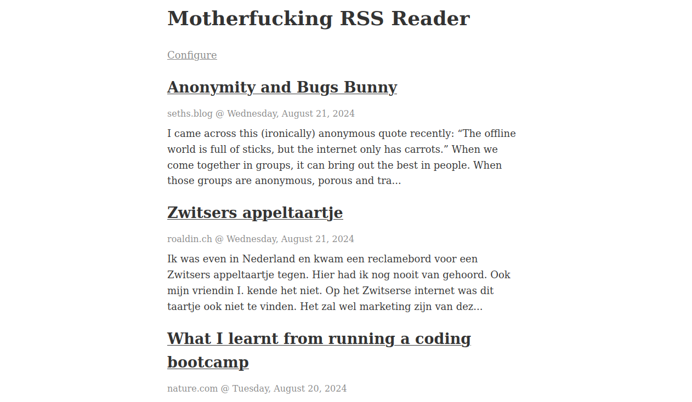

# Motherfucking RSS reader

_A basic RSS reader, in the spirit of the motherfucking websites._

An RSS reader without:
- registration
- login
- platform dependence
- javascript



## Developers

To install the project
- `dotnet restore`

To run the few unit test
- `cd SimpleRssServer.Tests`
- `dotnet test`

Starting the server. You can watch it at 127.0.0.1:5000
- `cd SimpleRssServer`
- `dotnet watch`

### Initial setup on Linux server

1. Copy the service configuration for the webserver from `./server-config/`, assuming you're in this top folder of this repo.
    - `sudo cp -i ./server-conf/mfrssreader-server.service /etc/systemd/system/mfrssreader-server.service`

1. Create the logging folders
    - `sudo mkdir -p /var/log/mfrssreader-server`
    - `sudo chown rss:1000 /var/log/mfrssreader-server`

1. Create the folder for the binaries. This is where the executable for the server is going to be.
    - `sudo mkdir /var/www/rss`

1. After creating the service file, reload the systemctl manager configuration to recognize the new service:
    - `sudo systemctl daemon-reload`

1. Enable the service to start automatically at boot:
    - `sudo systemctl enable mfrssreader-server.service`

1. Start the service immediately:
    - `sudo systemctl start mfrssreader-server.service`

1. Check if the service is running:
    - `sudo systemctl status mfrssreader-server.service`

1. Check the logs.
    View the logs (stdout) using:
        - `sudo tail -f /var/log/mfrssreader-server/rss.log`

    View the error logs (stderr) using:
        - `sudo tail -f /var/log/mfrssreader-server/rss.err`

### Deploying

To deploy, assuming the repo is cloned in `~/motherfucking-rss-reader/` and the setup above is done:
- `~/motherfucking-rss-reader/deploy.sh`

### Enabling HTTPS

#### Certificates

Certificates are created using https://certbot.eff.org/. Follow the instructions there to generate a certificate.

- Certificate is saved at: `/etc/letsencrypt/live/motherfuckingrssreader.com/fullchain.pem`
- Key is saved at: `/etc/letsencrypt/live/motherfuckingrssreader.com/privkey.pem`

#### nginx setup

> [!NOTE]
> .NET's `HttpClient` doesn't support HTTPS on Linux. Therefore we need nginx as a front end with SSL and the SimpleRssServer as non-SSL. See also this [GitHub discussion](https://github.com/dotnet/WatsonWebserver/discussions/90).

Setup

```
 --Client--             ---------Server--------------
|          |           |                             |
| Browser  | --------> | nginx  -->  SimpleRssServer |
|          |  Request  | :443        :8000           |
 ----------             -----------------------------
```

1. Install nginx according to the [instructions](http://nginx.org/en/linux_packages.html)
2. Copy content of `./server-conf/nginx.conf` to `/etc/nginx/nginx.conf`.
3. Start nginx
    - `nginx`

### Server paths overview

ngnix
- config: `/etc/nginx/nginx.conf`
- logs: `/var/log/nginx`

mfrssreader-server
- service: `/etc/systemd/system/mfrssreader-server.service`
- logs: `/var/log/mfrssreader-server/`
- source code: `~/motherfucking-rss-reader`
- binaries: `/var/www/rss`

## TODO
- [ ] Auto redirect to https
